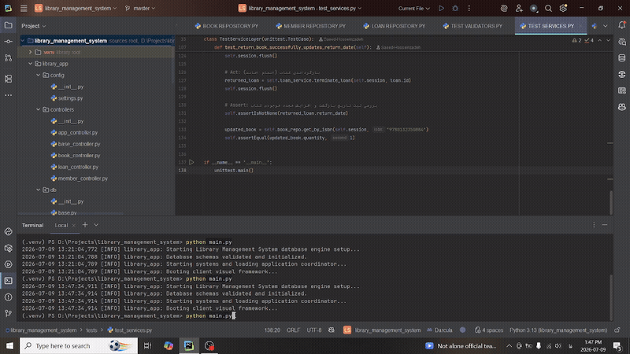

# Enterprise Library Management System (LMS)

A robust, enterprise-grade Desktop Library Management System built with **Python 3**, featuring a highly decoupled **Layered Architecture (Clean/Domain-Driven Design principles)**, driven by **SQLAlchemy ORM (2.0 style)**, and wrapped in an intuitive reactive interface using **Tkinter (ttk)**.

The project demonstrates production-ready patterns, including explicit Data Transfer Objects (DTOs), transactional session scopes (Unit of Work approximation), structured Domain Validation, custom Exceptions, and full inversion of control capability for unit testing.

---
---

## 🖥️ Application Demo

Here is a quick walkthrough of the Enterprise Library Management System, showcasing the end-to-end flow of adding books, registering members, issuing loans, and running the automated test suite:



---
## 🏗️ Architecture & Component Design

The system is rigorously isolated into distinctive conceptual layers to guarantee maximum maintainability, loose coupling, and individual component testability.

### Layer Separation
* **Domain & Validation Layer (`domain/`)**: Pure business logic, core invariant constraints, self-contained business validators, and custom application exceptions. Completely independent of frameworks or databases.
* **Database & Persistence Layer (`db/` & `repositories/`)**: Declarative database models mapping cleanly to physical engines, paired with the *Repository Pattern* to encapsulate querying logic away from application business workflows.
* **Service Layer (`services/`)**: The orchestrator of application use-cases. Coordinates data transformations via custom Data Transfer Objects (DTOs), boundaries business state updates, evaluates invariants, and acts as the strict operational perimeter.
* **Controller Layer (`controllers/`)**: Acts as an API gateway for the UI. Safely manages transaction boundaries via unified database contextual scopes (`session_scope`) and returns generic, deterministic outcome wrappers (`ControllerResult`) containing typed payloads or descriptive, user-friendly failures.
* **Presentation Layer (`views/`)**: A rich, modular Tkinter desktop client decoupled from underlying logic, communicating exclusively via structured Controller entrypoints.

---

## 📂 Project Structure

```text
library_management_system/
│
├── library_app/
│   ├── config/                     # Application configurations & runtime settings
│   │   └── settings.py
│   │
│   ├── domain/                     # Pure Business Core (Framework Independent)
│   │   ├── exceptions.py           # Strongly-typed domain-specific exceptions
│   │   └── validators.py           # Enterprise invariant validation rules
│   │
│   ├── db/                         # Persistence Infrastructure Mapping
│   │   ├── base.py                 # Core SQLAlchemy Declarative Registries
│   │   ├── models.py               # Optimized mapping schemes & relations
│   │   └── session.py              # Context-managed transaction boundary handlers
│   │
│   ├── repositories/               # Isolation layer for persistent IO actions
│   │   ├── book_repository.py
│   │   ├── member_repository.py
│   │   └── loan_repository.py
│   │
│   ├── services/                   # Application Use-Cases & Workflow Orchestration
│   │   ├── book_service.py         # Handles inventories, stock checks, and mutations
│   │   ├── member_service.py       # Manages unified membership allocations
│   │   └── loan_service.py         # Automates atomic lease execution/termination
│   │
│   ├── controllers/                # Boundary transactional API mappings
│   │   ├── base_controller.py      # Unified ControllerResult interfaces
│   │   ├── book_controller.py
│   │   ├── member_controller.py
│   │   ├── loan_controller.py
│   │   └── app_controller.py
│   │
│   ├── utils/                      # Shared Helper Utilities & Auxiliary Toolsets
│   │   ├── __init__.py             # Package initialization boilerplate
│   │   └── validators.py           # Low-level input laundering & structural validation
│   │
│   └── views/                      # UI Components & Hierarchical Event Wiring
│       ├── main_window.py          # Application desktop framework root
│       ├── book_view.py            # Inventory tracking window layout
│       ├── member_view.py          # Membership index & profiling UI
│       └── loan_view.py            # Dynamic loan registers & processing
│
├── requirements.txt                # Production dependency registry
├── run.py                          # Unified Application bootstrap script
└── README.md                       # Architectural documentation